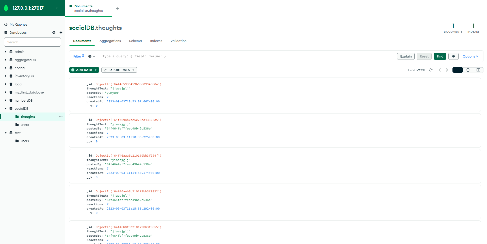

# Social Network API

## Description
This social network API was created to be used as a backend database and server application for a social media platform. This API allows users to easily add social media user information, posts, and reactions to a MongoDB database with the intention of being utilized by a front-end web application.

## Usage
You can watch a video walkthough of this application on YouTube at 

This application can be run from a GitBash terminal using node.js by navigating to the file location and starting the application using the 'node server' command. Once the application is running, the database will be accessible using Insomnia or a similar API platform. Users can perform CRUD operations on the database using the API routes for Users and Thoughts. Thoughts are also able to have reactions posted and deleted from the database.

## Credits
This backend application was coded entirely by me, with help from the University of Denver Coding Bootcamp example material, Stack Overflow, and Google.

## License
MIT License

Copyright (c) 2023 Ron Buttermore

Permission is hereby granted, free of charge, to any person obtaining a copy
of this software and associated documentation files (the "Software"), to deal
in the Software without restriction, including without limitation the rights
to use, copy, modify, merge, publish, distribute, sublicense, and/or sell
copies of the Software, and to permit persons to whom the Software is
furnished to do so, subject to the following conditions:

The above copyright notice and this permission notice shall be included in all
copies or substantial portions of the Software.

THE SOFTWARE IS PROVIDED "AS IS", WITHOUT WARRANTY OF ANY KIND, EXPRESS OR
IMPLIED, INCLUDING BUT NOT LIMITED TO THE WARRANTIES OF MERCHANTABILITY,
FITNESS FOR A PARTICULAR PURPOSE AND NONINFRINGEMENT. IN NO EVENT SHALL THE
AUTHORS OR COPYRIGHT HOLDERS BE LIABLE FOR ANY CLAIM, DAMAGES OR OTHER
LIABILITY, WHETHER IN AN ACTION OF CONTRACT, TORT OR OTHERWISE, ARISING FROM,
OUT OF OR IN CONNECTION WITH THE SOFTWARE OR THE USE OR OTHER DEALINGS IN THE
SOFTWARE.
